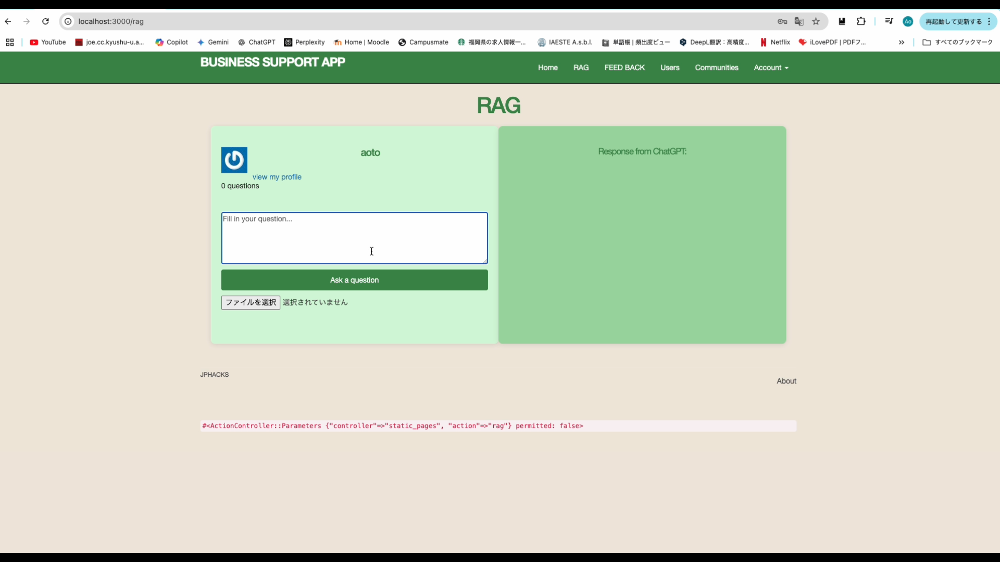

# ワーキングサポート

## 製品概要
### 背景 (製品開発のきっかけ、課題等)
社内で膨大な書類や規約にアクセスし、必要な情報を迅速かつ正確に取得するのは大変です。また、社員が業務の中で感じる疑問（例：企画書の完成度についてのフィードバック）に即時に対応する仕組みがないため、上司に頻繁に確認する必要が生じ、業務効率が低下することがあります。このプロダクトは、社内のナレッジを効果的に活用し、効率的に業務を進めるための支援ツールとして開発されました。

### 製品説明（具体的な製品の説明）
「ワーキングサポート」は、AI技術を活用して社内文書の検索機能とワーキングサポートの二つの役割を持つサービスです。特に生成AIとRAG（Retrieval-Augmented Generation）技術を採用することで、膨大な文書データベースから関連する情報を即座に抽出し、ハルシネーションを抑えた正確な情報提供が可能です。社員はチャット形式で簡単に質問でき、例えば企画書のレビューや業務に関するフィードバックを受けることで、効率的に業務を進められるようになります。

### 特長
#### 1. 高精度な社内文書検索機能
社員が必要とする情報を迅速に提供し、業務の効率化を図ります。

#### 2. 社員の疑問解決に特化したチャットボット
業務に関する質問に対し、AIが正確なフィードバックを提供します。

#### 3. コミュニティ機能によるナレッジ共有
フォローフォロワーシステムや履歴機能を通じて、社員同士で知見を共有することで、チームワークの向上を目指します。

### 解決出来ること
- 社員の質問頻度の低減と業務時間の短縮
- 膨大な社内文書からの効率的な情報取得
- コミュニティを通じた知識共有の活性化

### 今後の展望
#### 以下の機能の作成
- 社内文書のファイル形式でのアップロード機能
- 質問時のファイルをアップロード機能 
- コミュニティ内での質問履歴の共有
- 外部データの連携
- フィードバックアルゴリズムの改善

### 注力したこと（こだわり等）
* 社内文書検索システムにおいて、ハルシネーションを防ぐRAGの実装
* セキュリティを確保するための、パスワードによるユーザログイン機能と、コミュニティ機能の作成
* AIからの回答をどのように表示させるのか、履歴を残すのかなどの部分に力をいれた

## 開発技術
### 活用した技術
#### API・データ
* OpenAI API
* 社内データベース(サンプル)

#### フレームワーク・ライブラリ・モジュール
* Ruby on Rails
* LangChainrb
* Node.js

#### デバイス
* Webブラウザ

### 独自技術
#### ハッカソンで開発した独自機能・技術
* RAGを活用した社内文書検索システム
* コミュニティ機能によるフォロー機能と検索履歴管理

##デモンストレーションによる実装済み機能紹介
### デモンストレーション動画1 -ユーザを作成してログイン/ユーザページの確認-
https://github.com/user-attachments/assets/ac6b29cd-3822-4c82-ab58-93549dd0c5f4

#### 内容
* sign upからユーザ作成画面へ移動して「名前」「メールアドレス」「パスワード」「パスワード再確認」を入力
* この時「名前は空欄ではいけない」「メールアドレスは空欄ではいけない」「メールアドレスはxxx@yyyy.zzzの形式でないといけない」「すでに使用されているメールアドレスであってはいけない」「パスワードは空欄ではいけない」「パスワードと再確認は一致していないといけない」「パスワードは6文字以上でなくてはいけない」という制約を施すことで、強固なセキュリティを確保した
* ユーザが作成されて個人ページが表示されたことを確認

### デモンストレーション動画2 -作成されたユーザの確認/コミュニティの作成・確認-
https://github.com/user-attachments/assets/30d5be5a-f3d0-47a5-a0bf-ae90a26f847e

#### 内容
* usersにはサインアップ済みユーザが一覧で表示される
* usersの最後に作成したばかりのユーザが格納されていることを確認
* 続けてcommunitiesからコミュニティ一覧を表示・新規作成
* コミュニティには「すでに使用されている名前であってはいけない」という制約を施す
* コミュニティが作成されてそのコミュニティの専用ページが表示されたことを確認
* また、communitiesの最後に新たに格納されたことを確認

### デモンストレーション動画3 -他者が作成したコミュニティのフォロー/RAGによる社内文書検索/自コミュニティとフォロー済みコミュニティへの検索履歴の表示-
https://github.com/user-attachments/assets/bb1d6868-62e6-4dcb-a67e-02666d60805c

#### 内容
* 他者が作成したコミュニティのページに入り、フォローボタンをクリック
* 続けてRAGページに入り、社内情報に関する質問をフォームから送信(事前に研修期間についての情報を与えているため回答が得られる)
* 質問とその答えは自分が作成したコミュニティおよび自分がフォローしたコミュニティに表示され、履歴として残る
* 不具合のため今はどこかのコミュニティをフォローすると、全てのコミュニティをフォローしたことになる

### デモンストレーション動画4 -ユーザ情報の変更/ユーザ個人ページへの履歴の表示-
https://github.com/user-attachments/assets/e2c5cb88-896b-4c78-aecb-17461e9fdbcd

#### 内容
* Settingsをクリックするとユーザ情報を変更できる
* 変更するとユーザ個人ページへ自動で遷移する
* 先程の質問履歴は個人ページにも表示されていたことを確認
